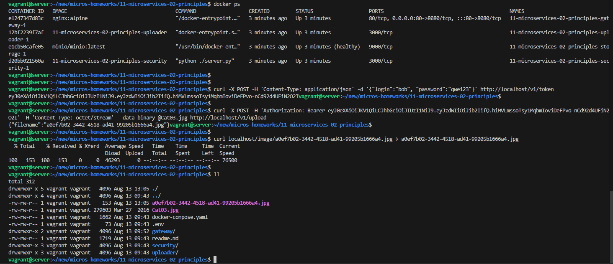

# Домашнее задание к занятию «Микросервисы: принципы»

Вы работаете в крупной компании, которая строит систему на основе микросервисной архитектуры.
Вам как DevOps-специалисту необходимо выдвинуть предложение по организации инфраструктуры для разработки и эксплуатации.

## Задача 1: API Gateway 

Предложите решение для обеспечения реализации API Gateway. Составьте сравнительную таблицу возможностей различных программных решений. На основе таблицы сделайте выбор решения.

Решение должно соответствовать следующим требованиям:
- маршрутизация запросов к нужному сервису на основе конфигурации,
- возможность проверки аутентификационной информации в запросах,
- обеспечение терминации HTTPS.

Обоснуйте свой выбор.

## Решение:

| Брокер сообщений | Маршрутизация запросов к нужному сервису на основе конфигурации | Возможность проверки аутентификационной информации в запросах | Обеспечение терминации HTTPS |
| :--- | :---: | :---: | :---: |
| NGINX | + | + | + |
| Kong | + | + | + |
| Yandex API Gateway | + | + | + |

Я бы использовал Yandex API Gateway, поскольку пользоваться продуктом можно прямо из коробки и не требуется больших затрат по времени для первичной настройки. Хоть он и небесплатный.

## Задача 2: Брокер сообщений

Составьте таблицу возможностей различных брокеров сообщений. На основе таблицы сделайте обоснованный выбор решения.

Решение должно соответствовать следующим требованиям:
- поддержка кластеризации для обеспечения надёжности,
- хранение сообщений на диске в процессе доставки,
- высокая скорость работы,
- поддержка различных форматов сообщений,
- разделение прав доступа к различным потокам сообщений,
- простота эксплуатации.

Обоснуйте свой выбор.

## Решение:

На лекции были упомянуты Kafka и RabbitMQ , их и рассмотрим:

| Брокер сообщений | Поддержка кластеризации | Хранение сообщений на диске в процессе доставки | Высокая скорость работы | Поддержка различных форматов сообщений | Разделение прав доступа | Простота эксплуатации |
| :--- | :---: | :---: | :---: | :---: | :---: | :---: |
| RabbitMQ | + | + | + | + | + | + |
| Kafka | + | + | + | + | + | + |

Оба брокера ( с некоторыми оговорками) соответсвуют требованиям. Для окончательного выбора нужно понимать для чего будет использваться брокер:
- Kafka однозначно подходит для работы с big data, так как репликация и параллельная обработка теоретически могут масштабировать систему до бесконечности. Так же можно извлечь из очереди сообщения за любой момент времени.
- RabbitMQ используют для фоновой обработки данных и для интеграции внутри приложений и между ними (между микросервисами), т.е там где вам важен сам факт доставки сообщений, но порядок доставки не принципиален.

## Задача 3: API Gateway 

## Решение:

Исправленные nginx.conf, requirements.txt и Dockerfile [по ссылке](./11-microservices-02-principles/)

