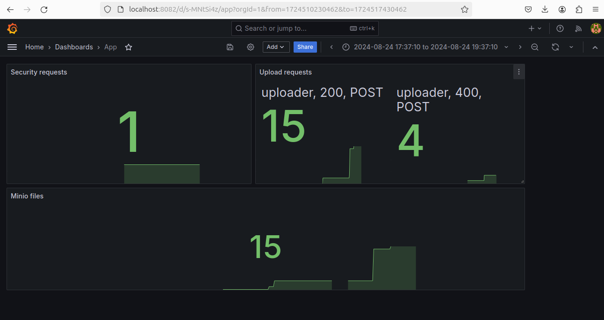

# Домашнее задание к занятию «Микросервисы: подходы»

Вы работаете в крупной компании, которая строит систему на основе микросервисной архитектуры.
Вам как DevOps-специалисту необходимо выдвинуть предложение по организации инфраструктуры для разработки и эксплуатации.

## Задача 1: Обеспечить разработку

Предложите решение для обеспечения процесса разработки: хранение исходного кода, непрерывная интеграция и непрерывная поставка. 
Решение может состоять из одного или нескольких программных продуктов и должно описывать способы и принципы их взаимодействия.

Решение должно соответствовать следующим требованиям:
- облачная система;
- система контроля версий Git;
- репозиторий на каждый сервис;
- запуск сборки по событию из системы контроля версий;
- запуск сборки по кнопке с указанием параметров;
- возможность привязать настройки к каждой сборке;
- возможность создания шаблонов для различных конфигураций сборок;
- возможность безопасного хранения секретных данных (пароли, ключи доступа);
- несколько конфигураций для сборки из одного репозитория;
- кастомные шаги при сборке;
- собственные докер-образы для сборки проектов;
- возможность развернуть агентов сборки на собственных серверах;
- возможность параллельного запуска нескольких сборок;
- возможность параллельного запуска тестов.

Обоснуйте свой выбор.

## Решение

В данном случае однозначно Gitlab, так как в требованиях перечисленны все его возможности и сильные стороны.

GitLab — ППО для полного контроля над производственным циклом ПО. Активно использует
Ruby и Redis, есть возможность как использовать SaaS (Software as a Service), так и установить
на своей инфраструктуре.

## Задача 2: Логи

Предложите решение для обеспечения сбора и анализа логов сервисов в микросервисной архитектуре.
Решение может состоять из одного или нескольких программных продуктов и должно описывать способы и принципы их взаимодействия.

Решение должно соответствовать следующим требованиям:
- сбор логов в центральное хранилище со всех хостов, обслуживающих систему;
- минимальные требования к приложениям, сбор логов из stdout;
- гарантированная доставка логов до центрального хранилища;
- обеспечение поиска и фильтрации по записям логов;
- обеспечение пользовательского интерфейса с возможностью предоставления доступа разработчикам для поиска по записям логов;
- возможность дать ссылку на сохранённый поиск по записям логов.

Обоснуйте свой выбор.

## Решение:

Основываясь на требованияx , я бы выбрал ELK stack.

- Elasticsearch (хранение и поиск данных)
- Logstash (конвеер для обработки, фильтрации и нормализации логов)
- Kibana (интерфейс для удобного поиска и администрирования)

Эти три компонента располагаются на сервере,а на клиент устанавливается Beat(бывают разные, например, Filebeat).

## Задача 3: Мониторинг

Предложите решение для обеспечения сбора и анализа состояния хостов и сервисов в микросервисной архитектуре.
Решение может состоять из одного или нескольких программных продуктов и должно описывать способы и принципы их взаимодействия.

Решение должно соответствовать следующим требованиям:
- сбор метрик со всех хостов, обслуживающих систему;
- сбор метрик состояния ресурсов хостов: CPU, RAM, HDD, Network;
- сбор метрик потребляемых ресурсов для каждого сервиса: CPU, RAM, HDD, Network;
- сбор метрик, специфичных для каждого сервиса;
- пользовательский интерфейс с возможностью делать запросы и агрегировать информацию;
- пользовательский интерфейс с возможностью настраивать различные панели для отслеживания состояния системы.

Обоснуйте свой выбор.

## Решение:

В данном случае я бы использовал Prometheus - инструмент с открытым исходным кодом для мониторинга и оповещения. Он «вытягивает» метрики (измерения) из микросервисов, отправляя HTTP-запросы, и сохраняет результаты в базе данных временных рядов. Использование клиентских библиотек, предоставляемых Prometheus, позволяет создавать и собирать специальные показатели сервисов.

## Задача 4: Логи и Задача 5: Мониторинг * (необязательная)

все файлы по ссылке [по ссылке](./11-microservices-02-principles/)

